# Contributors Guide #

Adding code to a project like [ArchNemesis](https://github.com/juanaldayparejo/archnemesis-dist) is not a trivial thing to get right, especially when multiple people will be working on the same files at the same time and their changes may conflict with eachother. There are various tools that have been created to deal with this problem, ArchNemesis uses the [**git**](https://git-scm.com/) version control software. If you are already familiar with **git** you can skip most of this guide but please read [INSERT IMPORTANT BITS HERE].

I will assume that you are able to **install git** and have a **github account** set up. Most of this guide will be devoted to using **git** in such a way that is (hopefully) easy to understand, easy to reverse any problems, and has a low risk of breaking anything in local or remote repositories.

#### Useful Links ####

* [ArchNemesis](https://github.com/juanaldayparejo/archnemesis-dist)

* [git](https://git-scm.com/)

* [**install git**](https://git-scm.com/install/linux)

* [github](https://github.com)

## A Quick Introduction to Git ##

**Git** attempts to solve a problem that most people have had, when working on a project wanting to keep old versions of files in case you make a mistake and need to go back to using the old version. Personally I've done the process of naming files progressively odd things (e.g. "thesis.txt", "thesis1.txt", "thesis1_v2.txt", "thesis2.txt", "thesis2_v2.txt", "thesis_final.txt", "thesis_final_v1.txt", "thesis_final_really.txt",...) in an attempt to make sure I don't lose anything or save over anything. The way git solves this is threefold, it uses **patches**, **commits**, and **branches**. The following explanation will not be exactly correct, but should give you an intuitive understanding of how git does its job, so you know where to look if (when) something goes wrong.

A **patch** is a *difference* that can be applied to a file (or directory) to put it into a new state. For example, the **patch** between "file1.txt" (`this file contains some text`) and "file2.txt" (`this file contains some more text`) is the addition of the word `more` between `some` and `text`. If I call the **patch** "file1.txt->file2.txt", I can generate "file2.txt" by applying the **patch** to "file1.txt", and I can generate "file1.txt" by *reversing* the **patch** from "file2.txt". For a directory, a **patch** records the additions and removals of items in that directory. The exact way that **git** generates and applies **patches** is out of scope of this guide, but you don't need to know the exact details to use the system.

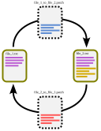

A **commit** is a set of **patches** that are grouped together for ease of recording *why* the changes in those **patches** were made. As **commits** are just sets of **patches**, they can be applied and reversed just like **patches** can. And the **commit message** should tell you what the intent of the changes were. For example, one of the **commits** in ArchNemesis involves moving a large number of values from a single large file to separate files (which makes it easier to find them, and easier to only use the bits you need). This involved lots of changes across lots of files, they could not be all contained in a single **patch** (and even if they could, a human would have difficulty understanding what the **patch** did). The **commit** grouped all the required changes together and the **commit message** briefly told other people what those changes did. In **git**, the **commits** are what you will be interacting with most of the time, **patches** are automatically created by **git** (using fancy algorithms) so ideally you never touch them directly, you only deal with sets of them (and a set may have only one member if needed) via **commits**.

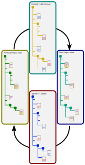

So far, you can sort of see how **git** works as a version control system. Assuming I have a directory tree that contains my project (ArchNemesis in our case), whenever I make a change to ArchNemesis, **git** creates a **patch** that records that change. I periodically **commit** those patches with a **commit message** that tells me what the changes I made since the last **commit** are (and do). The current state of my project is completely described by the **chain of commits** I have made. If I ever decide I don't like the changes I made, I can ask **git** to *reverse* the **commits**, and I read the **commit messagess** to know when to stop *reversing* them. Then, all of the bad changes are undone and I can start again.

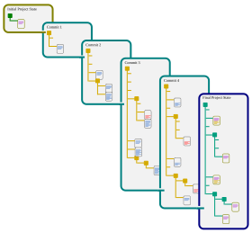

When there is only one person working on a project, you can get away with just using **commits**. However, when two or more people are working on the project that starts to become a problem. For example, assume we are both working on ArchNemesis. We are both adding new atmospheric models, so we both need to add a file to ".../archnemesis/Models/PreRTModels/". As we are adding separate files, that's not to bad. I make my changes and **commit** them, then you make your changes and **commit** them. However, if I now want to undo my changes I have to *reverse both* **commits** (because mine was first), but I cannot just re-apply your **commit** as your **commit** assumes the ArchNemesis project is in the state *after* my **commit**, so I have to ask you to re-do your work. That's a pretty simple example, but imagine the problems that happen if we both edit the *same* file. We could have problems where we both make changes that break the others code. What we would need in this situation is a way for both of us to have our own copy of the project, make our changes, then reconcile our changes after we are both happy with them. In **git** doing this is called making a **branch**.

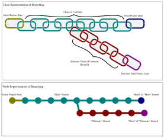

As the current state of a project is completely described by the **chain of commits** made to that project, a **branch** is an *alternate* **chain of commits** that **branches** off from the **parent chain of commits**. Really, a **branch** *is a* **chain of commits**. So I can use the terms **parent branch** to describe the **chain of commits** a **branch** starts from, and I can call the first **chain of commits** the **main branch**. Therefore, if our hypothetical project consists of a single **main branch** (i.e. the **chain of commits** up to the current point), if we both want to work on it we can both create a **branch** from the **main branch**, make all the changes we need then we can **merge** our **branches** back into the **main branch** after we are done. The **merge** operation is how we reconcile all the changes we both made. Often **git** is clever enough to require no action on your part, but if we have both altered same place of the same file we will have **merge conflicts** that need to be addressed manually. This may sound much like the problem we started with (one of us has do re-do work), but generally **merge conflicts** are much easier to **resolve** than trying to do the same thing without **branches**. The process of switching **branches** is to **checkout** a **branch**.

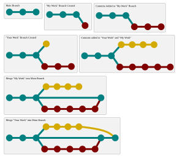

So far I have been using "project" to describe the thing being worked upon, however the proper **git** name is **repository** or "**repo**". You may also have come across the term **fork** (used as in "to **fork** a **repo**"). There is a bit more to it, but you can think of **forks** as "super **branches**". A **fork** is a copy of a **repo** made at a certain point in the **upstream repo**'s **commit history**. **Forks** are full copies are *owned* by you, they can end up dramatically divierging from the **upstream repo**. For ArchNemesis, I recommend creating a **fork** of the main ArchNemesis **repo** to provide a barrier that means it is harder to add bad code to the **upstream repo**. 

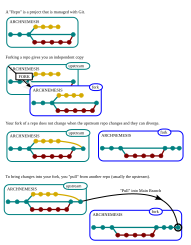

When moving changes between **repos** there are two things that are analogous to **merges**, the process of *sending* changes from a source **repo** to a destination **repo** is called **pushing**, and *getting* changes into destination **repo** from a source **repo** is called **pulling**. When both source and destination **repos** are controlled by you that works fine. However, normally otherpeople don't let you send data to their **repo** without their say-so, to *ask* a **repo** to accept changes you send a **pull request** which *asks* them to **pull** changes from your **repo** into theirs. **pull requests** are the main way of sharing code between **forks**. NOTE: **pull** and **push** always operate between specific branches of the source and destination **repos**, but I may be a bit sloppy with my language and imply that they occur between **repos** not **branches** of **repos** elsewhere in this guide.

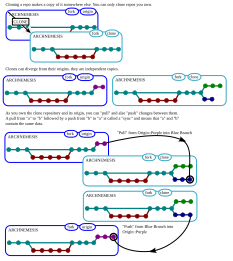

To share **repos** between people, they are generally hosted on a **git server** which is a web-server that runs **git** and generally allows **forking** and **cloning** of **repos** hosted on it. **Github** is such a **git server**, it has extra functionality to help you manage **repos**. When you take a **repo** from **github** and put it on your local machine, you are actually making a **clone** on your local machine, a **clone** is very similar to a **fork**, but instead of an **upstream repo** it has an **origin repo** (the **repo** it was **cloned** from). Any changed (e.g., **commits**, **branches**, etc.) to the **local repo** are not sent to the **repo** on the server (the **origin repo**) until you **sync** them (i.e. **push** local changes and **pull** remote changes).

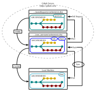

#### Nomenclature ####

* **git** - the software that provides version control.

* **repository**/**repo** - the directory that completely contains the files and folders that are version controlled (e.g. a project).

* **patch** - the way **git** represents changes to a project.

* **commit** - a set of **patches** combined with an informative **commit message**.

* **branch** (noun) - a **chain of commits** that describes the state of a **repo**.

* **branch** (verb) - To start a new **chain of commits** (**branch**) from a **parent chain of commits** (**parent branch**).

* **main branch** - the **chain of commits** that describes the state of a **repo** and can be traced directly back to the start of the **repo**.

* **merge** - the process of combining changes from one **branch** into another **branch**.

* **fork** (noun) - a copy of a **repo** that is now owned by you, can be thought of as a "super **branch**". NOTE: a **fork** is itself a **repo** and can therefore be **forked** itself.

* **fork** (verb) - the process of copying a **repo** that was not already owned by you, the **repo** that is copied from is called the **upstream repo**.

* **upstream repo** - the **repo** that was **forked** from, not all **repos** have an **upstream repo**, only those that were **forked**.

* **clone** (verb) - the process of copying a **repo** that is owned by you, the **repo** that was **cloned** is called the **origin repo**.

* **origin repo** - the **repo** that was **cloned** from, not all **repos** have an **origin repo**, only those that were created by **cloning**.

* **local repo** - a repository on your local machine. When using a **git server**, the remote **repo** on the server is **cloned** to make a **local repo** on your machine.

* **git server** - a web-server that hosts **repos** (e.g. **github**).

* **push** - the process of sending code from our **repo** to a different **repo**.

* **pull** - the process of getting code from a different **repo** into our **repo**.

* **pull request** - a way to *ask* a **repo** to accept code from your **repo**, usually the only way to send changes to a **repo** you do not own.

* **sync** - the process of **pulling** and **pushing** code from a **repo** so it matches another **repo**.

* **fetch** - the process of synchronising changes between a **local repo** and its **origin repo**, does not actually apply the changes.

## Suggested Git Usage for ArchNemesis ##

If you are confident and familiar with **git** you can probably skip this section. Like any useful and powerful tool, **git** has the ability to do very bad things (e.g. delete not just yours, but everyone elses data). It's quite hard to get it to do anything *really* bad, but it is less difficult to get into a state that is *very frustrating* for even someone with experience to recover from. The main operations that cause problems are: **merging** branches that have lots of changes, and you don't notice that some of your files get deleted; **pushing** changes to an **upstream repo** and breaking things for other users of that **repo**.

To mitigate those risks, I suggest the following way of using **git** (NOTE: This is not "the best" way, but I've found it stops me having to fight with the more arcane **git** commands when something goes wrong).

### Initial Setup ###

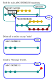

1) Make a **fork** of the [main ArchNemesis repo](https://github.com/juanaldayparejo/archnemesis-dist) for yourself. We will only send changes to the **upstream repo** via **pull requests**, that way someone will have to review the changes and everything breaks it's not only your fault (the person who accepted the changes should have caught it too).

    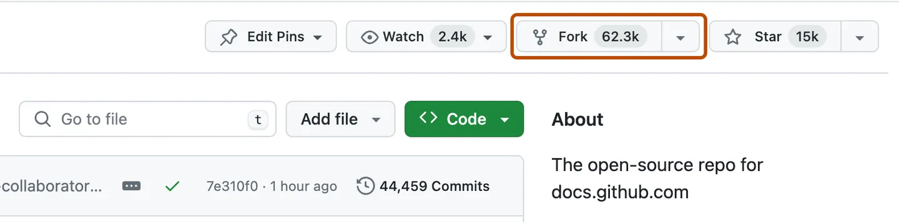

1) Delete all other **branches** (if there are any) except the "main" **branch**, and mark it as the "default" **branch** if it is not already. This **branch** will be where most other **branches** are created from and **merged** into, but in-progress work will be done in different **branches** we create later.

    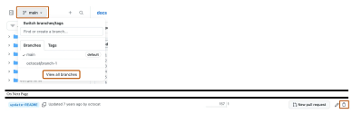

    [HOW TO MARK A BRANCH AS DEFAULT](https://docs.github.com/en/repositories/configuring-branches-and-merges-in-your-repository/managing-branches-in-your-repository/changing-the-default-branch#changing-the-default-branch)

1) Create a new **branch** from the "main" **branch** called "tracking". The idea is that we will periodically manually sync the "tracking" branch with the **upstream repo** (the main ArchNemesis repo) so we can control when the changes come in.

    [HOW CREATE BRANCHES](https://docs.github.com/en/pull-requests/how-tos/commit-changes/managing-branches-within-your-repository#creating-a-branch-via-the-branches-overview)

### Update From Main ArchNemesis Repo ###

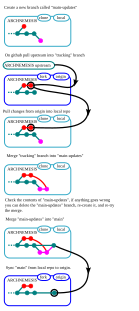

NOTE: These instructions are for updating the "main" **branch**, but can apply to any **branch**, just replace "main" with the name of the desired **branch**.

NOTE: This process is designed so you can start again at any point by deleting the "main-updates" branch and re-starting from step (1). You do not touch the "main" **branch** until the final step, by which time you should have checked that everything is good.

1) In your **local repo**, create a new **branch** from "main" called "main-updates" and **checkout** "main-updates".

    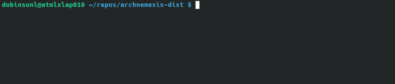

1) On **github**, **sync** the "tracking" **branch** with the **upstream repo**.

    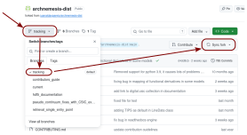

1) In your **local repo**, **pull** the changes from the **origin repo** into your local "tracking" **branch**.

1) **merge** the "tracking" **branch** with "main-updates", and resolve any **merge conflicts**.

    [ADD INSTRUCTIONS ON HOW TO SOLVE MERGE CONFLICTS]

    1. If the **merge conflicts** are difficult to solve, ask for help.

1) Check through the "main-updates" **branch** and make sure the changes did not do anything unexpected.

    1. You may want to run the tests.
    
    1. Running any example retrievals you have that use the new code is also a good idea.
    
    1. If there are errors here, delete the "main-tracking" **branch** and start again from step (1), asking for help with the merge is always an option.
  
1) By this point the "main-updates" branch should be correct. **Checkout** the "main" branch.

1) **merge** the "main-updates" **branch** into "main". The merge *should* complete automatically, or if not there *should be no* **merge conflicts** as they were all resolved earlier. If there are, cancel the **merge** and ask for help.

1) **sync** the "main" **branch** in your **local repo** with the **origin repo**.

If the final step completed successfully, the "main" branch is now up-to-date with the **upstream ArchNemesis repo**, both locally and remotely.

### When Starting Work on a New Task ###

[ADD GRAPHICAL REPRESENTATION OF PROCESS]

NOTE: If you just want to work from a single **branch**, you can apply the below to a "current" **branch** instead of making one for each new task.

1) Perform the steps in [Update From Main ArchNemesis Repo].

1) Create a new **branch** from "main" with a descriptive name for the task you are doing, I will call this **branch** "task-branch" for now.

1) **Checkout** "task-branch" and do all your work on this task in this branch.

### When Finishing Work on a Task - Issuing a Pull Request ###

[ADD GRAPHICAL REPRESENTATION OF PROCESS]

NOTE: If you just want to work from a single **branch**, you can apply the below to "current" **branch** that is used repeatedly (but don't delete it at the end).

NOTE: I will call the **branch** for the task "task-branch".

1) Swapping "main" for "task-branch", perform the steps in [Update From Main ArchNemesis Repo].

1) Run all the tests. If they do not pass, fix any issues and run the tests again until they do.

1) **sync** "task-branch" with the **origin repo** (the **repo** on the server).

1) Within **github** navigate to the `Actions` for your **repo**. The workflow runs here are the same tests you ran earlier, but run for all versions of Python that ArchNemesis supports. It is possible that they fail even though the ones you ran earlier passed. If any fail, fix the issue and **sync** again until they pass.

    [ADD INFORMATION ABOUT WORKFLOW RUNS AND HOW TO TELL WHY THEY FAIL]

1) Start a **pull request** to the **upstream ArchNemesis repo**. 
  [ADD SCREEN CAPS TO SHOW PROCESS]

    1. Within **github** navigate to the "task-branch".
    
    1. About 1/3 of the way down the screen there is a "Contribute" button, click that.
    
    1. From the drop-down choose "Open Pull Request".
  
1) Fill out the **pull request** form. 
   
     [ADD SCREEN CAPS TO SHOW PROCESS]

    1. Make sure the title describes succinctly what the changes are intended to do.
    
    1. Add a description of the changes. The person reviewing can see the *diffs* if they want to, so focus on:

        1. What the changes are meant to do.
        
        1. Which files pertain to which changes.
        
        1. Any problems you forsee that you want the reviewer to check.
        
        1. How to run a check that the changes work if it is non-trivial.

    1. When done click the green "Create Pull Request" button at the bottom-right of the description area.

1) Try to not do any more work on the "task-branch" **branch**. If you have to do more work, change the **pull request** to a *draft* before you do, and mark it as *ready for review* when you have finished. This stops the reviewer having to review a moving target.

1) Wait for the **pull request** to be accepted. There may be comments that need addressing before acceptance, address them and mark the comment as resolved.

1) When the **pull request** has been accepted, perform the steps in [Update From Main ArchNemesis Repo] to pull the changes into your **repo**.

1) The "task-branch" **branch** can now be deleted. NOTE: You will have to delete it on your **local repo** and the **origin repo**.

